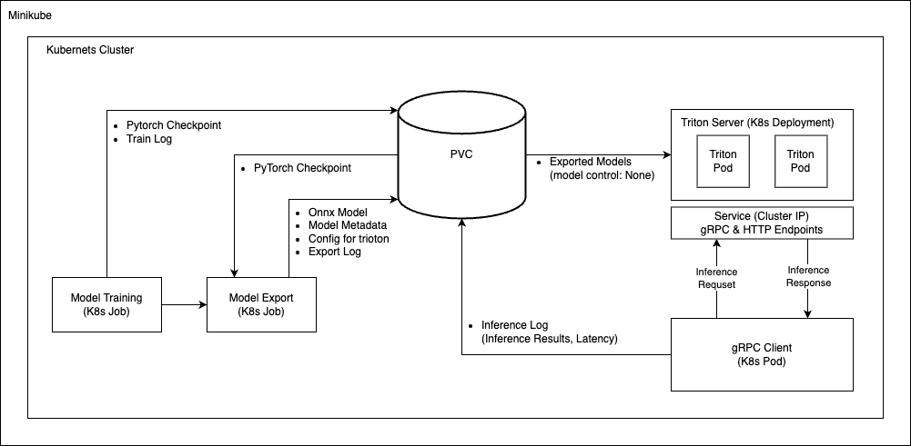

# 사전과제

각 컴포넌트별 설명 : [링크](COMPONENTS.md)

## 1. Overeall Architecutre


## 2. 환경설치
- 실습 환경 
    - OS: Linux 20.04
    - CPU : Ryzen 5800X (8Core 16Thread)
    - Memory : 64G
- 관련 설치 : [Docker](https://docs.docker.com/engine/install/ubuntu/), [KVM2](https://young-cow.tistory.com/86), [Minikube](https://minikube.sigs.k8s.io/docs/start/?arch=%2Fmacos%2Farm64%2Fstable%2Fbinary+download)
- Minikube Cluster Setting 

    ```bash
    $ minikube start --listen-address=0.0.0.0 --cpus 12 --memory 32384 --disk-size=100g --driver=kvm2
    ```
- [`Helm`](https://helm.sh/ko/docs/intro/install/) install
    ```
    $ curl -fsSL -o get_helm.sh https://raw.githubusercontent.com/helm/helm/main/scripts/get-helm-3
    $ chmod 700 get_helm.sh
    $ ./get_helm.sh
    ```
- [`krew`](https://helm.sh/ko/docs/intro/install/) install
    1. Run command
        ````bash
        $ (
            set -x; cd "$(mktemp -d)" &&
            OS="$(uname | tr '[:upper:]' '[:lower:]')" &&
            ARCH="$(uname -m | sed -e 's/x86_64/amd64/' -e 's/\(arm\)\(64\)\?.*/\1\2/' -e 's/aarch64$/arm64/')" &&
            KREW="krew-${OS}_${ARCH}" &&
            curl -fsSLO "https://github.com/kubernetes-sigs/krew/releases/latest/download/${KREW}.tar.gz" &&
            tar zxvf "${KREW}.tar.gz" &&
            ./"${KREW}" install krew
        )
    2. Setting Path in `.bashrc`
        ````bash
        export PATH="${KREW_ROOT:-$HOME/.krew}/bin:$PATH"
- `ns` install  
    ```
    $ kubectl krew install ns
    ```


## 3. Deploy with Helm
````bash
$ cd pyler_MLOps

$ helm install pyler-jh helm-chart/ --namespace pyler-jh-ns --create-namespace